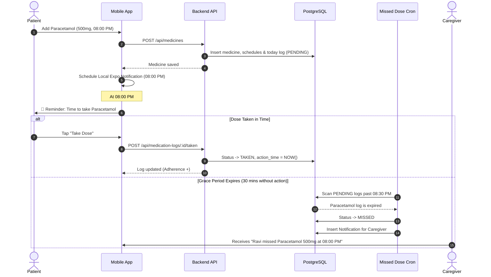
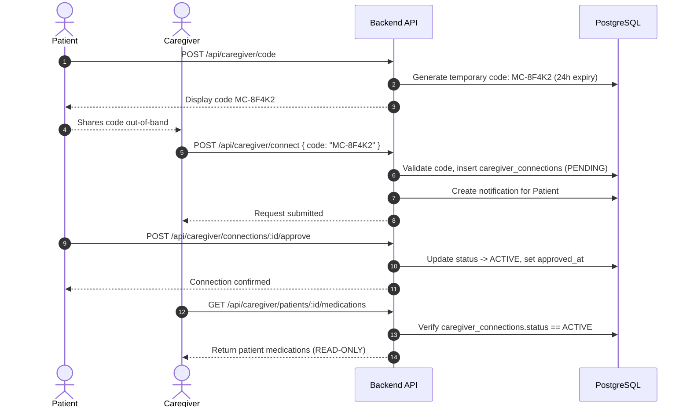

# MediCircle User Flows & Interactions

## 1. Medication Scheduling & Action Flow

```mermaid
sequenceDiagram
    autonumber
    actor Patient
    participant Mobile as Mobile App
    participant API as Backend API
    participant DB as PostgreSQL
    participant Cron as Missed Dose Cron
    actor Caregiver

    Patient->>Mobile: Add Paracetamol (500mg, 08:00 PM)
    Mobile->>API: POST /api/medicines
    API->>DB: Insert medicine, schedules & today log (PENDING)
    API-->>Mobile: Medicine saved
    Mobile->>Mobile: Schedule Local Expo Notification (08:00 PM)

    Note over Mobile: At 08:00 PM
    Mobile->>Patient: 💊 Reminder: Time to take Paracetamol

    alt Dose Taken in Time
        Patient->>Mobile: Tap "Take Dose"
        Mobile->>API: POST /api/medication-logs/:id/taken
        API->>DB: Status -> TAKEN, action_time = NOW()
        API-->>Mobile: Log updated (Adherence +)
    else Grace Period Expires (30 mins without action)
        Cron->>DB: Scan PENDING logs past 08:30 PM
        DB-->>Cron: Paracetamol log is expired
        Cron->>DB: Status -> MISSED
        Cron->>DB: Insert Notification for Caregiver
        Caregiver->>Mobile: Receives "Ravi missed Paracetamol 500mg at 08:00 PM"
    end
```

---

## 2. Caregiver Connection Flow

```mermaid
sequenceDiagram
    autonumber
    actor Patient
    actor Caregiver
    participant API as Backend API
    participant DB as PostgreSQL

    Patient->>API: POST /api/caregiver/code
    API->>DB: Generate temporary code: MC-8F4K2 (24h expiry)
    API-->>Patient: Display code MC-8F4K2

    Patient-->>Caregiver: Shares code out-of-band

    Caregiver->>API: POST /api/caregiver/connect { code: "MC-8F4K2" }
    API->>DB: Validate code, insert caregiver_connections (PENDING)
    API->>DB: Create notification for Patient
    API-->>Caregiver: Request submitted

    Patient->>API: POST /api/caregiver/connections/:id/approve
    API->>DB: Update status -> ACTIVE, set approved_at
    API-->>Patient: Connection confirmed

    Caregiver->>API: GET /api/caregiver/patients/:id/medications
    API->>DB: Verify caregiver_connections.status == ACTIVE
    API-->>Caregiver: Return patient medications (READ-ONLY)
```
